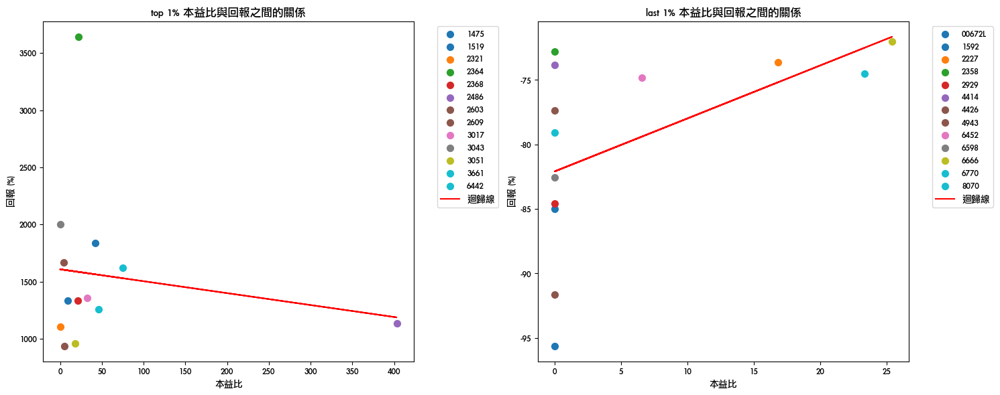
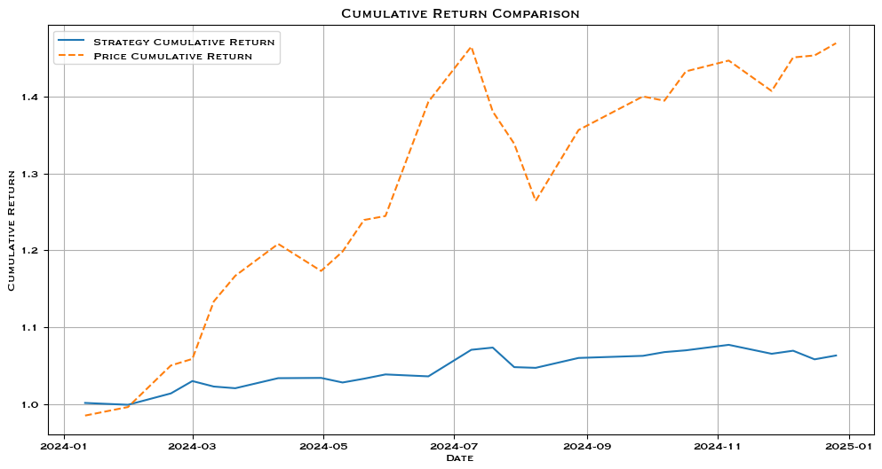
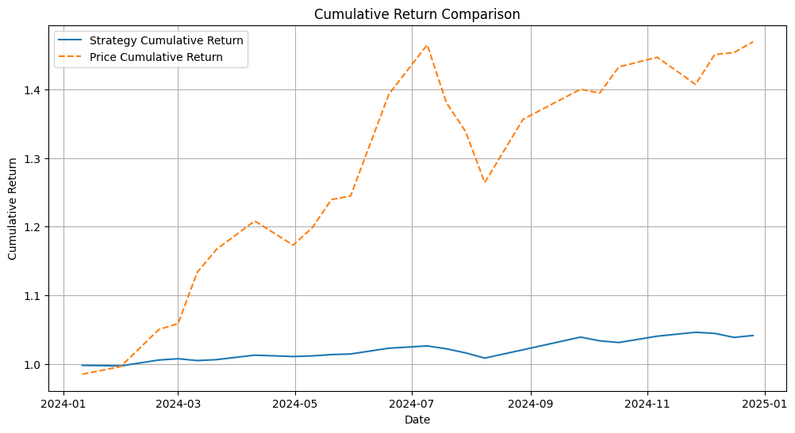
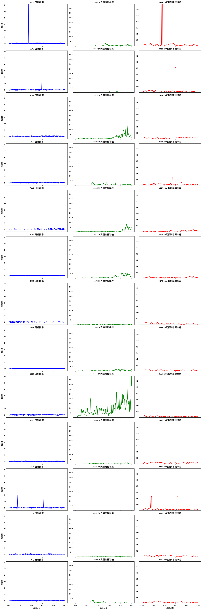
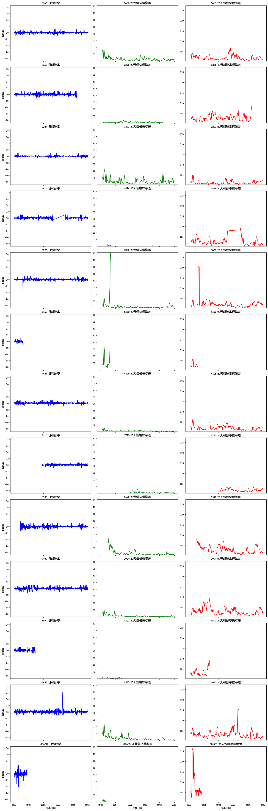

## 1. 爬蟲 & 數據處理

首先我們先用 requests 和 BeautifulSoup 等套件來解析 https://www.twse.com.tw/zh/trading/historical/mi-index.html。在這裡我們注意到 該網站的資料載入是透過 GET 方法，因此我們是使用 requests.get() 方法。由網站的 HTML 結構可以得知，請求的參數為 date、type 和 response，分別代表查詢的時間、表格分類，以及回傳的資料格式。

由於我們的目標是 每日收盤行情（全部，不含權證、牛熊證），因此 type 參數我們設定為 ALLBUT0999，而回傳格式則設為 json。詳細的請求與資料處理邏輯實作在 web_crawling.py 中。

爬取回來的數據我們會先做基本處理，包含：

	•	將民國日期轉為西元（利於後續統一時間格式處理）

	•	把所有數字欄位去除千分位逗號（例如成交股數由 "1,234,567" → 1234567）

	•	對於所有遺失值（遺失值（NaN））統一填入 0（`fillna(0)`）

	•	把資料欄位中含有中文或符號的部分進行解析與格式轉換，例如「漲跌(+/-)」、「漲跌價差」等

之後一併上傳到本地新增的SQLite。方便之後做數據探討。

## 2. 數據分析與因子建構
1. 在做基礎資料分析時，我們首先先看各個column的基本分布。由於我們遺失值都填0，因此，所有float and int column min都是0。
2. 藉由**收盤價**與本益比</b>，我們可以算出股票的EPS，由於ETF本身沒有本益比，相關的EPS數字都會顯示0。
3. 我們首先觀察2020~2024 報酬率最高和最低的前與後1%股價。之後我們把報酬率與本益比做簡單的線性回歸。(本益比的數據是選擇股票在資料集的最後一比數據)

    
    由圖可見，報酬率最高的公司都落在本益比0~30之間，少數的超過30。相反報酬率最低的股價本益比幾乎都落在０左右，最高也不會超過25。
4. 之後我們對於兩個族群都畫出<b> 報酬、率20天價格標準差、20天報酬率標準差</b> (Figure 2 and 3)。
    從圖片我們可以發現，相對於報酬率較高的股票，報酬率較低的20天標準差以及20天報酬率標準差都比較低，且20天標準差都呈現Right skew 的分布。
5. 藉由以上圖表，我們假定公司的基本面和股價動能會影響報酬率。因此我們將目標return 為超過0050即可。由於0050是已經搜集臺灣50指數（或前50公司），因此任何策略的累積報酬率，都可看做失敗策略。此外，在模型訓練裡，我們不考慮任何稅以及費用。
6. 模型建構我們將參考<b>Fama-French three-factor model</b>和<b> Carhart four-factor model</b>，兩者模型都是由CAPM模型所演化出來的，兩者公式唯一的不同在於有無MOM（動量因子)。完整的公式如下：

    $R_i - R_f = \alpha + \beta_{MKT}(R_M - R_f) + \beta_{SMB}\times SMB + \beta_{HML}\times HML + \beta_{MOM}\times MOM + \epsilon_i$
    - $R_i$：個別股票或投資組合的回報率  
    - $R_f$：無風險利率 （我們將直接使用2%) 
    - $R_M$：市場組合的回報率（我們將使用大盤0050的回報率作為基準)
    - $(R_M - R_f)$：市場風險溢酬  

    - **SMB (Small Minus Big)**：將市場中所有股票依市值排序，分組（例如取最小的30%為小市值組，最大的30%為大市值組），然後計算各組的平均回報。因此我們需要額外爬取<b>股本數據</b>，來計算市值
    - **HML (High Minus Low)**：B/M 是 帳面價值比（Book-to-Market ratio） 
    H igh B/M - Low B/M  
    我們藉由計算<b>每股參考淨值</b> / <b> 股價</b>即可得到B/M，因此我們需要額外爬取 <b>每股參考淨值</b>

    - **MOM (Momentum)**：高動能股票組合報酬率與低動能股票組合報酬率之差，動能公式如下：
    - $R_i^{\text{formation}} = \frac{P_{i,t-2}}{P_{i,t-12}} - 1$
7. 所需額外數據：股本、每股參考淨值
    - 兩者都可以在公開觀測資訊站彙總報表中的現金流量表找到。
>

## 3. 模型訓練
我們把dataset 拆成兩部分：2020~2023去做建模, 2024一整年來做預測，並與0050作比較
1. 首先我們從 https://mopsov.twse.com.tw/mops/web/t163sb05 爬取額外的數據。網站dataset 是由ajax形式寄送，並且使用post method。接著我們用BeautifulSoup來幫我們做解析。由於股本與每股參考淨值是每季才會公開得數據，因此我們藉由dataset 中的交易日期來做判斷，每季的數字都會是一樣的。
2. <b>計算RI</b>
    我們針對每支股票計算日報酬率 R_i，並檢查缺失比例
    <b>計算SMB </b>
    - 我們提取從2020~2023 平均回報的top 3% and lowest 3% 相減來得到SMB
    
    <b>計算HML</b>
    - 首先我們把每股參考淨值 / 收盤價來得到 B/M
    - 我們提取從2020~2023 平均回報的top 3% and lowest 3% 的 B/M 相減來得到HML

3. <b>計算MOM</b>
    - 根據模型我們選用 42天和252交易日來計算MoM

## 4. 回測
1. <b>三因子策略模型 </b>
由於台灣2025第一季季報尚未公布，因此無法計算今年的MOM，因此回測的時間從2024-01-01~ 2024-12-31
兩個模型的持倉天數都是15天，每15天就會在挑選alpha 前10的股票
    - 根據回測結果，此模型的勝率約為55%，但總報酬率為 1.06%，遠遠低於0050的報酬率。
    
2. <b>四因子策略模型</b>
    - 根據回測結果，想叫於三因子模型，四因子更能解釋超額報酬的獲利來源，此模型的勝率約為67%，但總報酬率為 1.04%，些微低於三因子模型，且遠遠低於0050的報酬率。
    
    
## 5. 總結
1. 此策略是依照既有的因子模型來開發，因此在因子的選擇上，我們不需要太懷疑他的實用性。但由回測結果可見，不管是三因子或是四因子都無法很好的挑出alpha，由以下幾個原因：
    - 在計算SMB, HML, 和MOM時，資料有誤，遺失值沒有處理好，導致在計算beta 時有偏差
    - 訓練及不夠久，由於只有拿2020~2023來訓練模型，因此無法Generalize到其他時間
    - 因子不足：雖然三因子與四因子已被證實過是可行的模型，但少了情緒指標，並無法有效地解釋市場的漲與跌。
2. 限制與未來改進:
    - 在回測上，並沒有考慮手續費與交易稅。因此未來可以考慮到這些額外的費用，來更清楚的了解策略的有效度。
    - 未來可以嘗試機器學習模型，增加模型的多元性，與多樣化
## 6. Appendix
Figure3

Figure4

